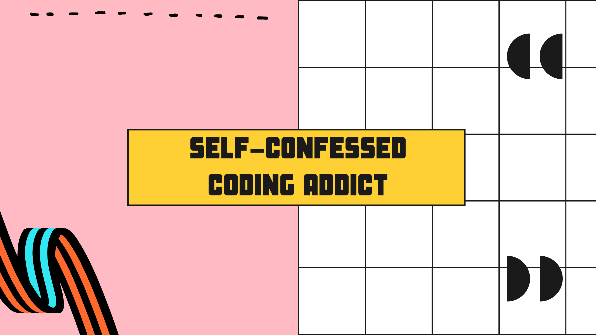

<h1>
  
</h1>

### Hi, I am Ana :information_desk_person:

- :computer: I'm a Full-stack developer 
- 🌱 I’m currently learning Python and Java
- 👯 I’m looking to collaborate on open source projects
- :octocat: To see my code, checkout the pins bellow

___________________________________________________________________________________________________________________________________________________

<table>
<tr>
<td>  
</td>
<td>
</td>
</tr>
</table>

_____________________________________________________________________________________________________________________________________________________

### Pinned

<table>
<tr>
<td><h2><a href="https://gist.github.com/skempfer/5a06841c2e41b8e97551573827635f73">Projects</a></h2>
  
</td>
<td><h2><a href="https://gist.github.com/skempfer/69d7a98db77202e2ac801c7c2a3c2ecb">Contact</a></h2> 
  
</td>
</tr>
</table>

